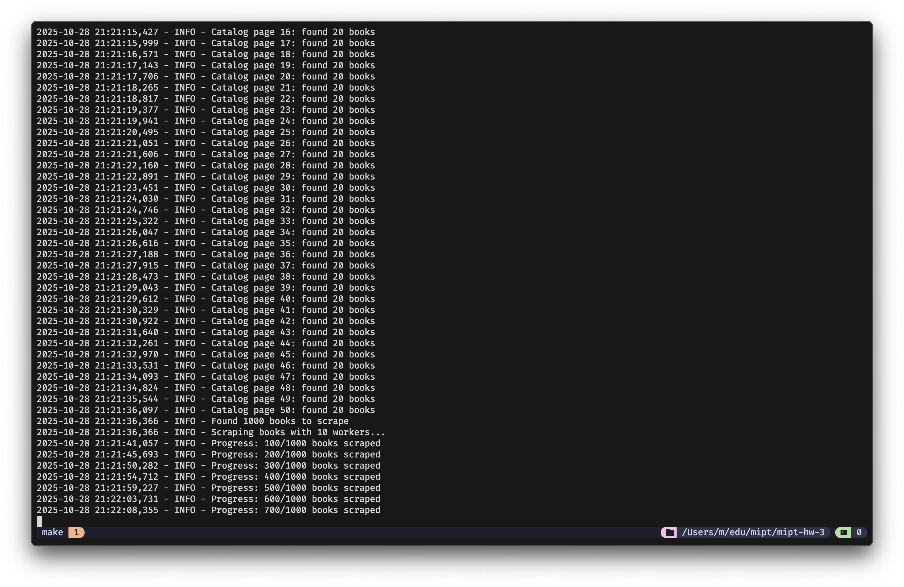

# Парсер книг

Веб-скрапер для сбора данных о книгах с сайта [Books to Scrape](http://books.toscrape.com).

## Скриншоты



## Описание

Проект реализует автоматический сбор данных о книгах:

- Извлечение данных об одной книге
- Парсинг всего каталога
- Автоматическое ежедневное выполнение
- Юнит-тесты
- Работа с Git

## Установка

```bash
git clone git@github.com:smirnoffmg/mipt-hw-3.git
cd mipt-hw-3
make install
```

Или вручную:

```bash
python -m venv .venv
source .venv/bin/activate
pip install -r requirements.txt
```

## Использование

### Запуск скрипта

```bash
make run
```

### Программное использование

```python
from scraper import get_book_data, scrape_books

# Парсинг одной книги
book_data = get_book_data('http://books.toscrape.com/catalogue/a-light-in-the-attic_1000/index.html')

# Парсинг всех книг с сохранением
all_books = scrape_books(is_save=True)

# Автоматическое выполнение каждый день в 19:00
from scraper import run_scheduler
run_scheduler()
```

## Структура проекта

```text
mipt-hw-3/
├── artifacts/           # Результаты парсинга
├── notebooks/           # Jupyter notebook
├── tests/              # Тесты
├── scraper.py          # Основной код
├── requirements.txt    # Зависимости
└── README.md          # Документация
```

## Тестирование

```bash
make test
```

Или вручную:

```bash
pytest tests/ -v --timeout=10
```

## Максим, откуда тут этот репозиторий?

Проект выполнен в рамках изучения курса "Программирование на Python" МФТИ.
